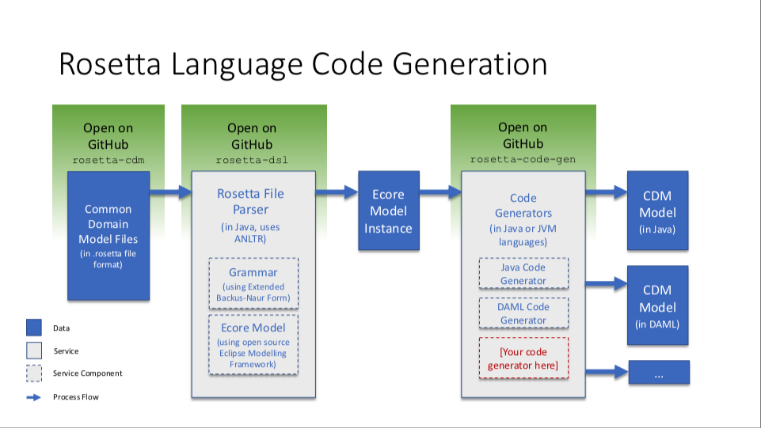

# Rosetta Code Generators

**Continuous Integration:** [](https://g.codefresh.io/pipelines/rosetta-code-generators/builds?repoOwner=REGnosys&repoName=rosetta-code-generators&serviceName=REGnosys%2Frosetta-code-generators&filter=trigger:build~Build;branch:main;pipeline:5d0a15a6a52a3deca9db7236~rosetta-code-generators)

 **License:** [Apache 2.0](http://www.apache.org/licenses/LICENSE-2.0)

**JavaDoc:** *Coming soon*

Do you want to adopt a technical standard expressed as a domain model in the *Rune DSL*, but in a language other than the default (Java) distribution? You can use this guide to write your own *code generator* in the language of your choosing.

## Pre-reqs

This project uses JDK 21.

## Why Code Generation?

The power of distributing a technical standard as a domain model is that you do not have to re-implement that technical standard in your particular language.

By contrast, traditional implentation of a technical standard that may be distributed in prose looks as follows:

1. Domain experts need to understand the intent of the entire standard content
1. Business analysts need to translate the above into a set of technical requirements
1. Software engineers need to turn those technical requirements into code

Each step comes with the risk of misinterpretation and implementation error, and the process is duplicated across each firm looking to adopt the standard, ultimately adding up to high implementation costs across the industry.

Systematically providing the domain model as executable code virtually eliminates this effort and replaces it with only having to develop code generation into another programming language.

The mechanism is also future-proof to future version updates of the model. Distribution in the chosen programming language will be automatically released with the model and version-controlled, providing firms with more robust control over the adoption of model updates in their own systems.

## What Code Generators Are Available?

[Rune](https://docs.rosetta-technology.io/rosetta/rune-dsl) is an open source *Domain-Specific Language* (DSL) comprising a *syntax* (or *grammar*) and a set of code generators. The [Rune DSL repository](https://github.com/REGnosys/rune-dsl) features one built-in code generator:

- [Java](https://www.oracle.com/java/) (compatible with Java 8 or later versions)

The [Rosetta Code Generator repository](https://github.com/REGnosys/rosetta-code-generators) provides additional code generators and allows the community to contribute code generators in any other languages. The languages currently supported are:

- [DAML](https://daml.com/)
- [Scala](https://www.scala-lang.org/)
- [TypeScript](https://www.typescriptlang.org/)
- [C#](https://docs.microsoft.com/dotnet/csharp/) (both C# 8.0 and 9.0 supported)
- [Go](https://golang.org/)
- [Kotlin](https://kotlinlang.org/)

## How Does It Work?

Code generation consists in *translating* from the Rune DSL syntax into the syntax of the chosen programming language.

The Rune DSL is based on the [Eclipse Modelling Framework](https://www.eclipse.org/modeling/emf/). Code generation works by allowing API hooks to access an [Ecore](https://wiki.eclipse.org/Ecore) representation of the model. The API expects a set *.rosetta* files as input. The files are parsed using an [ANTLR](https://www.antlr.org/)-generated parser and an Ecore model instance is produced. This Ecore model is then accessible via an API hook in this repository.

*Ecore* is a representation of a [syntax tree](https://en.wikipedia.org/wiki/Abstract_syntax_tree), which contains the entire information about a given model. Ecore therefore acts the pivot that allows to transform the model originally expressed in the Rune DSL into the model expressed in the chosen programming language. Code generation is based on [Xtext](https://www.eclipse.org/Xtext/) and the Rune DSL itself is expressed using Xtext.

Here is an illustration of how code generation works:



## Quick start guide

Note that you will need Java 21 SDK installed and referenced by the JAVA_HOME environment variable.

You will need [Maven](http://maven.apache.org/) and [Git](https://git-scm.com/) installed and configured in your environment.

[Fork and clone](https://help.github.com/articles/fork-a-repo) the project in your own workspace. Then run the first build:

``` Java
/path/to/workspace/rosetta-code-generators > mvn clean install
```

This project follows the Maven [multi-module](https://maven.apache.org/guides/mini/guide-multiple-modules.html) format, to make it easier to provide your own generator in its own separate module.

Simply come up with a sensible name for your module (it should relate to the progamming language that you want to generate code in) and run the following command:

``` Java
> mvn archetype:generate -DgroupId=com.regnosys.rosetta.code-generators  -DartifactId=my-language
```

This will create a module named after your artifactId with the appropriate maven structure and also update the parent `pom.xml`.

### Writing a generator

There is already an example module named *sample* to help you get going: we have written a rudimentary code generator (that generates some valid [Groovy](https://groovy-lang.org/) code):

``` Java
sample/src/main/java/com/regnosys/rosetta/generators/sample/SampleCodeGenerator.java
```

Within your just created module, create your own package under `com/regnosys/rosetta/generators` and add your source file(s). Your generator must subclass the `AbstractExternalGenerator` class and provide a concrete implementation of its `generate` method.

``` Java
public abstract Map<String, ? extends CharSequence> generate(RosettaJavaPackages packages, List<RosettaRootElement> elements, String version);
```

## Testing your generator

You can then test your code with a JUnit test, like in

``` Java
sample/src/test/java/com/regnosys/rosetta/generators/sample/SampleCodeGeneratorTest.java
```

In folder `sample/src/test/resources/rosetta` you can see the file: `sample.rosetta`. It contains a simple Rosetta text file with a few attributes of type `string` & `int`.

Finally, the file `sample/src/test/resources/sample/Foo.groovy.sample` contains the correct source code, against which we will compare our results.

The `test-helper` module contains some infrastructure code that is used to drive the tests in the other modules. It weaves together, using the [Google Guice](https://github.com/google/guice/) dependency injection mechanism, all the necessary elements to run a Rosetta-enabled application and parses a .rosetta file into the corresponding root Ecore object.

In folder `test-helper/src/main/resources/rosetta` you can see the file: `types.rosetta`. It contains the basic types contained in the Rune DSL, like `string`, `int`, `time` etc.

These types are used to bootstrap the Rosetta-enabled application.

## How to contribute

Please read the [detailed guide](https://github.com/REGnosys/rosetta-code-generators/blob/main/CONTRIBUTING.md).
