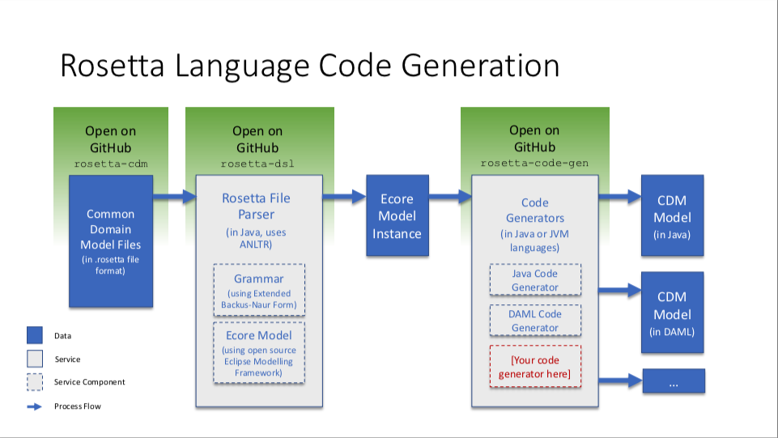

Rosetta Code Generators
=======================

.. role:: raw-html(raw)
    :format: html

**Continuous Integration:** |Codefresh build status| :raw-html:` `
**License:** `Apache 2.0 <http://www.apache.org/licenses/LICENSE-2.0>`_

**JavaDoc:** *Coming soon*

Do you want to adopt a technical standard expressed as a domain model in the *Rosetta DSL*, but in a language other than the default (Java) distribution? You can use this guide to write your own *code generator* in the language of your choosing.

Why Code Generation?
--------------------

The power of distributing a technical standard as a domain model is that you do not have to re-implement that technical standard in your particular language.

By contrast, traditional implentation of a technical standard that may be distributed in prose looks as follows:

#. Domain experts need to understand the intent of the entire standard content
#. Business analysts need to translate the above into a set of technical requirements
#. Software engineers need to turn those technical requirements into code

Each step comes with the risk of misinterpretation and implementation error, and the process is duplicated across each firm looking to adopt the standard, ultimately adding up to high implementation costs across the industry.

Systematically providing the domain model as executable code virtually eliminates this effort and replaces it with only having to develop code generation into another programming language.

The mechanism is also future-proof to future version updates of the model. Distribution in the chosen programming language will be automatically released with the model and version-controlled, providing firms with more robust control over the adoption of model updates in their own systems.

What Code Generators Are Available?
-----------------------------------

Rosetta is an open source DSL comprising a grammar and a set of default code generators (see `documentation <https://docs.rosetta-technology.io/dsl/readme.html>`_). The `Rosetta DSL repository <https://github.com/REGnosys/rosetta-dsl>`_ has 1 built-in code generator:

- `Java <https://www.oracle.com/java/>`_: see `code generator <https://github.com/REGnosys/rosetta-dsl/blob/master/com.regnosys.rosetta/src/com/regnosys/rosetta/generator/java/object/ModelObjectGenerator.xtend>`_

The Rosetta Code Generators repository currently provides 3 additional code generators and allows the community to contribute code generators in any other languages (e.g. Go, Python etc.):

- `DAML <https://daml.com/>`_: see `code generator <https://github.com/REGnosys/rosetta-code-generators/blob/master/daml/src/main/java/com/regnosys/rosetta/generator/daml/object/DamlModelObjectGenerator.xtend>`_
- `Scala <https://www.scala-lang.org/>`_: see `code genrator <https://github.com/REGnosys/rosetta-code-generators/blob/master/scala/src/main/java/com/regnosys/rosetta/generator/scala/object/ScalaModelObjectGenerator.xtend>`_
- `TypeScript <https://www.typescriptlang.org/>`_: see `code generator <https://github.com/REGnosys/rosetta-code-generators/blob/master/typescript/src/main/java/com/regnosys/rosetta/generator/typescript/object/TypescriptModelObjectGenerator.xtend>`_

How Does It Work?
-----------------

Code generation is akin to *translation* from the Rosetta DSL syntax into the syntax of the chosen programming language.

It works by allowing API hooks to access an `Ecore <https://wiki.eclipse.org/Ecore>`_ representation of a model. *Ecore* is a `syntax tree <https://en.wikipedia.org/wiki/Abstract_syntax_tree>`_ which contains the entire information about a given model (as originally expressed in the Rosetta DSL) and allows to perform a model transformation. The API expects a set *Rosetta* files (with extension *.rosetta*) as input. The files are parsed using an `ANTLR <https://www.antlr.org/>`_-generated parser and an Ecore model instance is produced. This Ecore model is then accessible via an API hook in this repository.

Here is an illustration of how code generation works:

Quick start guide
-----------------

Note that you will need Java 8 SDK installed and referenced by the JAVA_HOME environment variable.

You will need `Maven <http://maven.apache.org/>`_ and `Git <https://git-scm.com/>`_ installed and configured in your environment.

`Fork and clone <https://help.github.com/articles/fork-a-repo>`_ the project in your own workspace. Then run the first build:

.. code-block:: Java

 /path/to/workspace/rosetta-code-generators > mvn clean install

This project follows the Maven `multi-module <https://maven.apache.org/guides/mini/guide-multiple-modules.html>`_ format, to make it easier to provide your own generator in its own separate module.

Simply come up with a sensible name for your module (it should relate to the progamming language that you want to generate code in) and run the following command:

.. code-block:: Java

 > mvn archetype:generate -DgroupId=com.regnosys.rosetta.code-generators  -DartifactId=my-language

This will create a module named after your artifactId with the appropriate maven structure and also update the parent ``pom.xml``.

Writing a generator
^^^^^^^^^^^^^^^^^^^

There is already an example module named *sample* to help you get going:  we have written a rudimentary code generator (that generates some valid `Groovy <https://groovy-lang.org/>`_ code):

.. code-block:: Java

 sample/src/main/java/com/regnosys/rosetta/generators/sample/SampleCodeGenerator.java

Within your just created module, create your own package under ``com/regnosys/rosetta/generators`` and add your source file(s). Your generator must subclass the ``AbstractExternalGenerator`` class and provide a concrete implementation of its ``generate`` method.

.. code-block:: Java

 public abstract Map<String, ? extends CharSequence> generate(RosettaJavaPackages packages, List<RosettaRootElement> elements, String version);

Testing your generator
^^^^^^^^^^^^^^^^^^^^^^

You can then test your code with a JUnit test, like in

.. code-block:: Java

 sample/src/test/java/com/regnosys/rosetta/generators/sample/SampleCodeGeneratorTest.java

In folder ``sample/src/test/resources/rosetta`` you can see the file: ``sample.rosetta``. It contains a simple Rosetta text file with a few attributes of type ``string`` & ``int``.

Finally, the file ``sample/src/test/resources/sample/Foo.groovy.sample`` contains the correct source code, against which we will compare our results.

The ``test-helper`` module contains some infrastructure code that is used to drive the tests in the other modules. It weaves together, using the `Google Guice <https://github.com/google/guice/>`_ dependency injection mechanism, all the necessary elements to run a Rosetta-enabled application and parses a .rosetta file into the corresponding root Ecore object.

In folder ``test-helper/src/main/resources/rosetta`` you can see the file: ``types.rosetta``. It contains the basic types contained in the Rosetta DSL, like ``string``, ``int``, ``time`` etc.

These types are used to bootstrap the Rosetta-enabled application.

How to contribute
-----------------

Please read the `detailed guide <https://github.com/REGnosys/rosetta-code-generators/blob/master/CONTRIBUTING.md>`_.

.. |Codefresh build status| image:: https://g.codefresh.io/api/badges/pipeline/regnosysops/REGnosys%2Frosetta-code-generators%2Frosetta-code-generators?branch=master&key=eyJhbGciOiJIUzI1NiJ9.NWE1N2EyYTlmM2JiOTMwMDAxNDRiODMz.ZDeqVUhB-oMlbZGj4tfEiOg0cy6azXaBvoxoeidyL0g&type=cf-1
   :target: https://g.codefresh.io/pipelines/rosetta-code-generators/builds?repoOwner=REGnosys&repoName=rosetta-code-generators&serviceName=REGnosys%2Frosetta-code-generators&filter=trigger:build~Build;branch:master;pipeline:5d0a15a6a52a3deca9db7236~rosetta-code-generators
